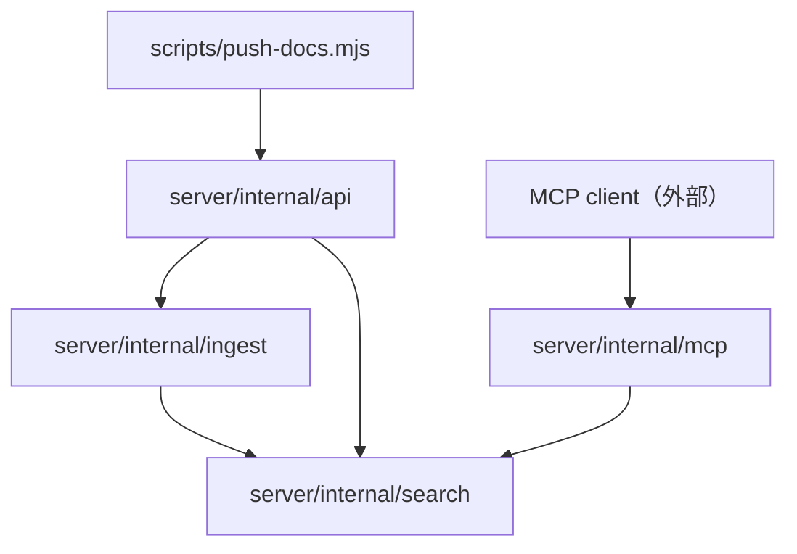

# 代码地图

新仓库，目录尚未创建，以下均为「规划」。

## 树

```
docs-mcp/
├── server/                   # 【规划】Go 模块，文档检索 + MCP 单服务
│   ├── cmd/server/           # main：装配配置、存储、REST 与 MCP handler，起 HTTP 服务
│   └── internal/
│       ├── api/              # REST handler 与路由（/api/v1/）
│       ├── mcp/              # MCP streamable HTTP 端点与 tools 定义
│       ├── ingest/           # 接收推送：鉴权、frontmatter 解析、整库替换写库
│       └── search/           # SQLite FTS5 索引与全文检索
├── scripts/
│   └── push-docs.mjs         # 零依赖 Node 推送脚本，用户复制到库仓库使用
├── .github/workflows/        # 【规划】GitHub Actions：测试 + 镜像构建推 GHCR
├── Dockerfile                # 【规划】多阶段构建服务端静态二进制
└── .agents/                  # 工程协作（docs/scripts 入库，cooking 忽略）
```

## 模块

| 模块 | 路径 | 职责 | 主要入口 |
| --- | --- | --- | --- |
| 服务端入口 | `server/cmd/server/` | 装配配置、存储、REST 与 MCP handler，起服务 | `server/cmd/server/main.go` |
| REST API 层 | `server/internal/api/` | 路由、请求/响应、错误格式 | `server/internal/api/` |
| MCP 端点 | `server/internal/mcp/` | streamable HTTP 端点，search / get_document / list_libraries tools | `server/internal/mcp/` |
| 推送接收 | `server/internal/ingest/` | 鉴权、frontmatter 解析、整库替换写入 | `server/internal/ingest/` |
| 索引与检索 | `server/internal/search/` | SQLite FTS5 建索引、bm25 + 标题加权、高亮片段 | `server/internal/search/` |
| 推送脚本 | `scripts/push-docs.mjs` | 扫描库内文档，HTTP 全量推送到服务端 | `scripts/push-docs.mjs` |

## 依赖



## 关键路径

- 推送：库仓库执行 `push-docs.mjs` → POST 服务端 `api` → `ingest`（鉴权 + frontmatter 解析）→ 整库替换写 SQLite 并重建 FTS5 索引。
- 检索：MCP client 连服务端 MCP 端点 → AI 调 search tool → `mcp` → `search` 查 FTS5 → 高亮片段经 MCP 返回；取全文走 get_document。
