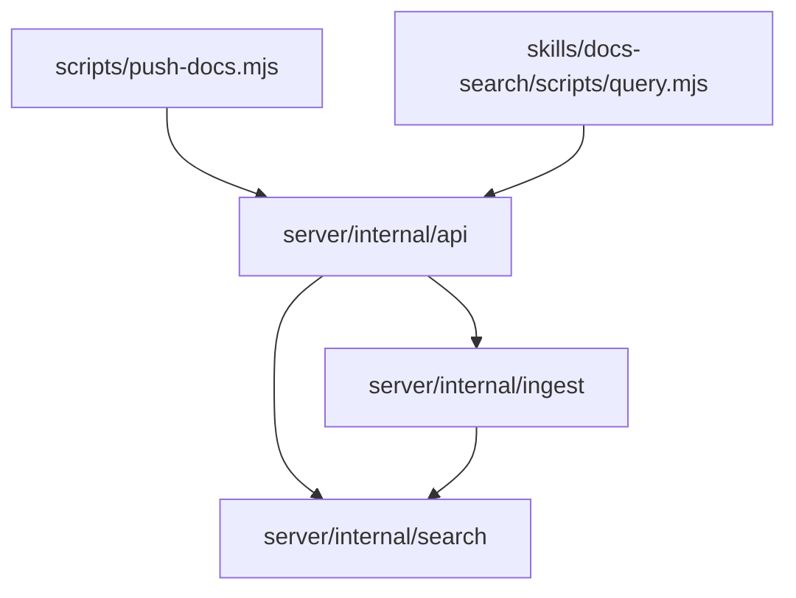

# 代码地图

`server/`、`scripts/`、`skills/` 与部署产物（CI 二进制发布）均已落地。

## 树

```
docs-mcp/
├── server/                   # Go 模块，文档检索 REST 单服务
│   ├── cmd/server/           # main：装配配置、存储、REST handler，起 HTTP 服务
│   └── internal/
│       ├── api/              # REST handler 与路由（/api/v1/），推送 Bearer 鉴权
│       ├── ingest/           # 接收推送：frontmatter 解析、整批校验、整库替换写库
│       └── search/           # SQLite FTS5 索引与全文检索
├── scripts/
│   └── push-docs.mjs         # 零依赖 Node 推送脚本，用户复制到库仓库使用
├── skills/
│   ├── docs-search/          # 检索技能：AI 运行内嵌查询脚本调 REST
│   └── docs-mcp/             # 库维护者接入技能：推送/文档标准；内含脚本副本
├── .github/workflows/        # GitHub Actions：测试 + v* tag 构建四平台二进制发 Releases
└── .agents/                  # 工程协作（docs/scripts 入库，cooking 忽略）
```

## 模块

| 模块 | 路径 | 职责 | 主要入口 |
| --- | --- | --- | --- |
| 服务端入口 | `server/cmd/server/` | 装配配置、存储、REST handler，起服务 | `server/cmd/server/main.go` |
| REST API 层 | `server/internal/api/` | 路由、推送 Bearer 鉴权、请求/响应、错误格式 | `server/internal/api/` |
| 推送接收 | `server/internal/ingest/` | frontmatter 解析、整批校验、整库替换写入 | `server/internal/ingest/` |
| 索引与检索 | `server/internal/search/` | SQLite FTS5 建索引、bm25 标题与别名加权、高亮片段、AND/OR 降级检索、章节切片 | `server/internal/search/` |
| 推送脚本 | `scripts/push-docs.mjs` | 扫描库内文档，HTTP 全量推送到服务端 | `scripts/push-docs.mjs` |
| docs-search 技能 | `skills/docs-search/` | 通用检索技能：指导 AI 运行内嵌脚本 list_libraries / search / get_document | `skills/docs-search/SKILL.md` |
| 查询脚本 | `skills/docs-search/scripts/query.mjs` | 零依赖 Node 脚本，读 `DOCS_SERVER_URL` 调 REST，stdout 打印 JSON | `skills/docs-search/scripts/query.mjs` |
| docs-mcp 技能 | `skills/docs-mcp/` | 库维护者接入技能：安装脚本/引导 .env/文档标准/执行推送；脚本副本须与 `scripts/push-docs.mjs` 同步 | `skills/docs-mcp/SKILL.md` |

## 依赖



## 关键路径

- 推送：库仓库执行 `push-docs.mjs` → PUT 服务端 `api`（Bearer 鉴权）→ `ingest`（frontmatter 解析 + 整批校验）→ 整库替换写 SQLite 并重建 FTS5 索引。
- 检索：agent 宿主运行 `docs-search` 查询脚本 → GET 服务端 REST（list_libraries / search / get_document）→ `api` → `search` 查 FTS5 → JSON 经 stdout 返回。
